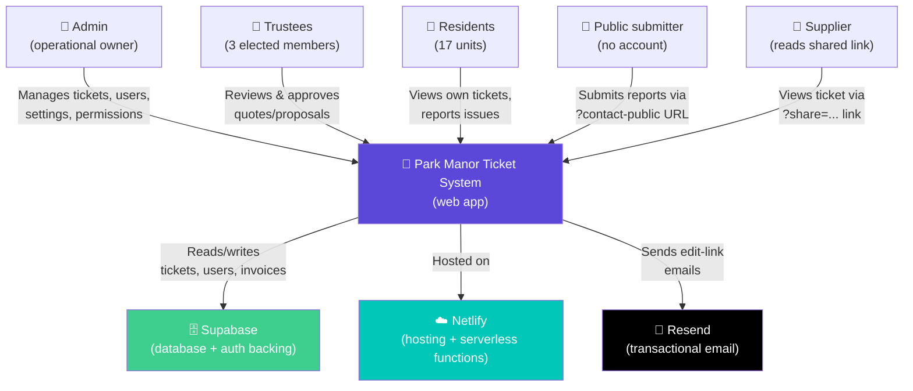

# Level 1: System Context

## What the system is

The Park Manor Ticket System is a body-corporate management app used by the trustees, admin, and residents of Park Manor sectional title scheme. It exists because managing maintenance, quotes, approvals, and communication for a 17-unit building via WhatsApp and email doesn't scale, and off-the-shelf property management tools cost more than a small scheme can justify.

## Who touches it

## What the system does

### For admin
- Full CRUD on tickets, invoices, suppliers, users
- Configure role-based permissions (10 configurable permission keys)
- Toggle the public reporting form on/off
- Reset any user's password
- Link public submissions to real user accounts
- Everything trustees and residents can do

### For trustees
- Approve or revoke approval on quotes and proposals attached to tickets
- Move tickets between statuses (Open → In Progress → Obtaining Quotes → Awaiting Approval → Work In Progress → Resolved)
- Once 3 trustees agree on the *same* item, work can start
- Add proposals of their own to any ticket
- Share read-only ticket links with third parties (suppliers, contractors)

### For residents
- View tickets they have permission to see
- Comment via the activity log (if permitted)
- Configurable per-role — the default resident is mostly read-only

### For the general public
- Submit a report/enquiry via `?contact-public` (no login)
- Return via a personal edit link (`?reportEdit=<token>`) to update while ticket is still "Open"
- Optionally receive the personal link by email

### For suppliers
- Open a read-only view of a specific ticket via `?share=<id>&t=<token>` — used to send them a quote request or status update

## External systems

### Supabase
The single source of truth for all data. Tables use a `{id, data}` shape where `data` is a JSONB blob — chosen because the app evolves faster than the schema needs to, and JSONB avoids constant migrations. See [data-model.md](./data-model.md).

### Netlify
Hosts the static site (`index.html` plus deploy metadata) and runs Netlify Functions for:
- Passkey enrolment and verification
- Password login via a serverless endpoint (JWT session issuance)
- Attachment upload/download proxying
- The `send-edit-link` function that emails public submitters their personal link

### Resend
Used only by the `send-edit-link` function. Free tier gives ~3,000 emails/month. Requires an API key stored in Netlify env vars.

## Boundaries

**What's IN the system:**
- Ticket lifecycle
- Approval workflow
- User & permissions management
- Attachment storage (via Supabase Storage indirectly, but stored as base64 JSON blobs in the invoices table — see the "known issues" section of the runbook)
- Public reporting portal
- Emailing personal edit links

**What's OUT of scope:**
- Accounting / financial ledger (the body corporate's actual books live elsewhere)
- Levy management
- Owner/tenant registry (residents are just app users; ownership records aren't tracked here)
- Legal document management beyond ticket attachments
- Meeting minutes management
