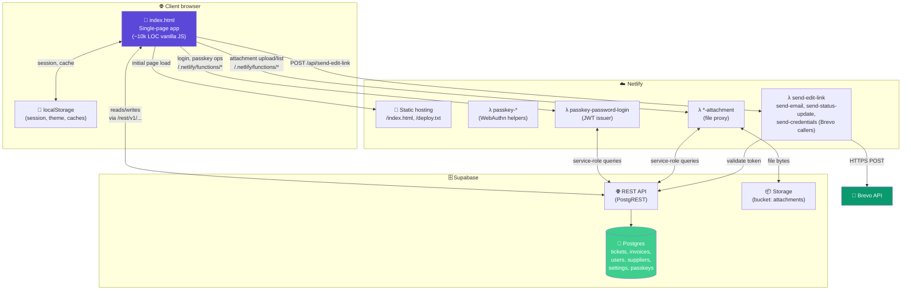

# Level 2: Containers

A "container" in C4 speak is a deployable / runnable unit — not a Docker container. For this system there are three runtime containers plus the developer's browser.



## Container-by-container

### The SPA (`index.html`)

- **Deployment:** static file served from Netlify. On deploy, `deploy.txt` is refreshed with the build timestamp so the client can detect stale versions.
- **Size:** ~1MB uncompressed HTML, comprising HTML + inline CSS + inline JavaScript. No build step. No bundler. No framework.
- **Why single-file:** every prior attempt to split it added tooling burden without clear benefit. The app runs, iterations are fast, git diffs are readable. If the file ever exceeds ~2MB or breaks 15k LOC, revisit.
- **Concurrency model:** everything runs in the main JS thread. There's a `visibilitychange` listener that resyncs data from Supabase when the tab regains focus (with a `_ticketSaveInFlight` flag to prevent races with in-progress writes).
- **State:** three flavours:
  1. **In-memory globals** (`TICKETS`, `INVOICES`, `SUPPLIERS`, `USERS`, `_currentUserObj`, etc.) — the primary working set.
  2. **Supabase** — durable source of truth. All mutations write through.
  3. **localStorage** — session tokens, theme preference, small caches. Not a source of truth; used for offline resilience and cross-tab hints.

### Netlify hosting

- **`public/`** contains everything served to the browser: `index.html`, `deploy.txt`, plus the `PASSKEYS_SETUP.sql` for reference.
- **`functions/`** contains the Netlify Functions (ESM syntax, `export default async function handler(req)`). Each function is a single file, self-contained, uses `fetch` to talk to Supabase directly.
- **Redirects:** most functions live under their default `/.netlify/functions/<name>` path. `send-edit-link` uses `export const config = { path: "/api/send-edit-link" }` for a cleaner URL. See individual function files.

### Supabase

- **REST API** (PostgREST): exposed at `${SUPABASE_URL}/rest/v1/<table>` with `apikey` and `Authorization: Bearer <key>` headers. The frontend uses the anon key; Netlify Functions use the service-role key.
- **Postgres**: six main tables (`tickets`, `invoices`, `suppliers`, `users`, `settings`, `passkeys`, `passkey_challenges`). See [data-model.md](./data-model.md).
- **Storage**: an `attachments` bucket for large files. Currently under-used — most photos are stored as base64 in `invoices.data`. This is a known limitation.

### Brevo (replaced Resend, August 2026)

- All email flows go through `functions/_email-shared.js` → `https://api.brevo.com/v3/smtp/email`.
- Four sending functions: `send-edit-link` (resident edit link + the agent/trustee
  notification with attachments and resident CC), `send-email` (supplier quote
  requests), `send-status-update` (reporter status-change emails), and
  `send-credentials` (login-details invites + forgot-password resets).
- Env: `BREVO_API_KEY`, `BREVO_FROM_EMAIL` (verified single sender — no domain
  needed on the free plan, 300 emails/day), optional `BREVO_FROM_NAME`.
- Known limitation: sending *from a Gmail address* via Brevo is DMARC-unaligned,
  so first deliveries often land in spam. The fix is a cheap domain
  authenticated in Brevo (SPF/DKIM); until then the UI coaches recipients to
  mark "Not spam".

## Data flow examples

### A resident opens a shared ticket link

```
Browser → GET https://parkmanor-bc.netlify.app/?share=t_xyz&t=abc123
Netlify → serves index.html (static)
SPA boots → detects _SHARE_MODE from URL params
SPA → fetches /rest/v1/tickets?id=eq.t_xyz&data->>shareToken=eq.abc123 (Supabase anon)
Supabase → returns the row (if token matches)
SPA → renders read-only ticket view
```

Nothing else happens. No auth, no session, no other network calls.

### A public submitter creates a ticket + gets an email

```
Browser → GET .../?report        (legacy ?contact-public still routes)
SPA → renders the public form
User submits → SPA → POST /rest/v1/tickets with the new record (via anon key)
Supabase → inserts
SPA → shows confirmation with edit link
IF user opted for email:
  SPA → POST /api/send-edit-link {email, editUrl, editToken, title, ticketNumber}
  Netlify Function → validates email + verifies editToken exists in tickets
  Netlify Function → POST https://api.resend.com/emails
  Resend → delivers to inbox
  Function → returns 200 to SPA
  SPA → updates status pill from "sending" → "sent"
```

Fire-and-forget: the confirmation renders immediately; the email status updates asynchronously.

## Why not a real backend?

A conventional Node + Express + Postgres backend was considered and rejected because:

- **Auth was already the hardest part.** With Supabase we get row-level access via API keys plus optional RLS. Sufficient for our threat model (small building, trusted admin).
- **Netlify Functions cover the few operations that need server-side authority** (JWT signing, service-role queries, sending emails). Adding a whole backend to house those would be overkill.
- **The team is one person.** A framework-heavy backend is a maintenance burden that this project can't afford. Everything above optimises for one person understanding the whole system in an evening.

If the project ever grows beyond this scale, the SPA can talk to any backend — replacing Supabase with a custom API is not architecturally hard because the frontend already speaks REST.

## Deployment topology

- **Production:** `park-manor-bc.netlify.app` (auto-deploys from `master` on the `Frans5351/Ticket-System` GitHub repo)
- **Local dev:** `/build/local/` package with `server.py` for a local HTTP server that proxies Supabase (avoids CORS in dev)
- **Standalone `index.html`:** the drop-in file that works without Netlify functions (passkey enrolment and email-the-link won't work, but everything else does)

## August 2026 flow update — what a public submission triggers

```
SPA → POST /rest/v1/tickets (anon key)             — ticket created
SPA → POST /api/send-edit-link                      — always (notifyOnly or full)
Function → reads `users` (service key, else anon fallback)
Function → recipients = management + trustee users with emails
                        (+ AGENT_NOTIFY_EMAIL), deduped
Function → Brevo: branded HTML email, images attached (≤ ~4MB budget),
           resident CC'd when they gave an address, reply-to = resident
Water readings (category "Water Reading") get a 💧 subject + green headline.
Status changes later → /api/send-status-update → reporter email per milestone.
```

`server.py` (local dev) forwards unknown `/api/*` requests to the production
site, so these flows work from `localhost:8080` too.
