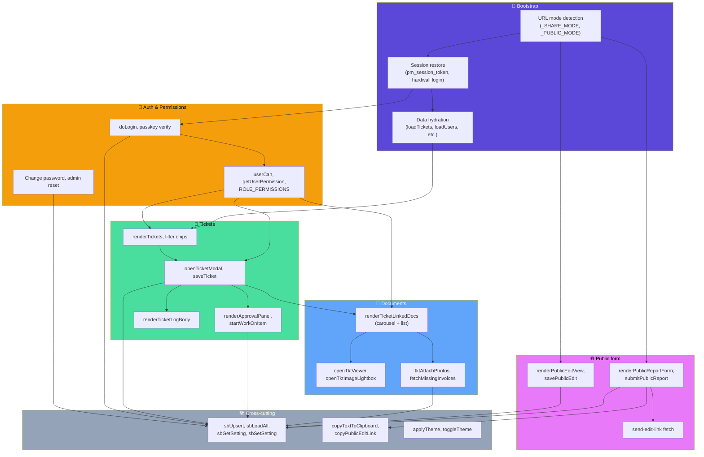

# Level 3: Components inside `index.html`

The SPA is one file but has clear logical modules. This diagram shows those modules and how they depend on each other. Each module is a **conceptual** grouping of functions that share responsibility — not a physical unit.

## Module-by-module

### 🚀 Bootstrap

**Responsibility:** decide what kind of session this is and hand off to the right view.

- **URL mode detection** — runs before any data loads. Reads `?share=<id>&t=<token>` → `_SHARE_MODE`, `?contact-public` or legacy `?report=1` → `_PUBLIC_MODE = {kind: 'submit'}`, `?reportEdit=<token>` → `_PUBLIC_MODE = {kind: 'edit', token}`. Everything else is a normal authenticated session.
- **Session restore** — checks `pm_session_token` in localStorage. If a valid JWT exists, restore silently. Otherwise, and unless we're in share/public mode, the hard-wall login modal opens on page load and can't be dismissed without authenticating.
- **Data hydration** — loads TICKETS, INVOICES, SUPPLIERS, USERS from Supabase in parallel. UI renders progressively as each loads.

### 🔐 Auth & Permissions

**Responsibility:** know who the user is and what they can do.

- **Login flow** — three paths:
  1. **Password** via `/.netlify/functions/passkey-password-login` returning a JWT
  2. **Passkey** (WebAuthn) via challenge/verify function pair
  3. **Legacy hardcoded admin** for the single admin bootstrap case (does not go through the server; less secure but needed to unlock the system without a working session)
- **Permissions framework** — 10 configurable permission keys (`canDeleteTickets`, `canEditOthersTickets`, `canApproveQuotes`, `canManageCriteria`, etc.). Resolution order:
  1. `admin` role always wins
  2. `user.permissions[key]` override
  3. `ROLE_PERMISSIONS[user.role][key]`
  4. `DEFAULT_ROLE_PERMISSIONS`
  5. `false` / `'never'`
- **Password management** — after every successful password login, users are prompted to change their password. Admin can reset any user's password from the user-edit modal.

### 🎫 Tickets (the core domain)

**Responsibility:** everything about creating, viewing, editing, and moving tickets through their lifecycle.

- **Ticket list** — the main tabs view. Filter chips by status. Cards show status pill, approval-count pill (for `awaiting_trustee_approval` tickets), `🌐 Public` badge for public submissions, priority stripe.
- **Ticket modal** — the big central UI. Description, status/priority/category/unit metadata, reporter info (including phone/email/user link), quotes/proposals for approval, linked documents, activity log.
- **Approval UI** — the domain-specific bit. A ticket needs **3 trustees to agree on the same single item** (quote or proposal) before work can start. Per-item counters show `N / 3`; the header shows `N / 3 agreed (top item)`. Once threshold is met AND user has `canChangeStatus`, a green "▶ Start Work" button appears.
- **Activity log** — collapsible per-ticket audit trail. Every status change, approval, edit gets an entry with timestamp and actor.

### 📎 Documents

**Responsibility:** attach, view, and manage files linked to tickets.

- **Document rendering** — splits linked docs into images (carousel with big preview + thumbnail strip) and other docs (compact card list). Non-image docs use the existing card style; PDFs and quotes look identical in the list.
- **Viewer** — modal viewer for individual docs. Images load with a spinner while the base64 decodes. PDFs use an iframe. Neighbour preload (prev + next) for instant carousel paging.
- **Image lightbox** — full-screen preview with prev/next arrows, keyboard navigation (← → ESC), and tap-outside-to-close.
- **Attach flow** — mobile camera capture, gallery picker, or link-existing-doc-by-search. Photos are compressed client-side before upload.
- **Resync** — admin/trustee button that both pulls down missing photos from Supabase and pushes up local-only ones. Handles the case where public submissions leave photos on Supabase that admin's local cache hasn't seen.

### 🌐 Public form

**Responsibility:** the "no-login" front door for residents, tenants, and the general public.

- **Submit form** (`?contact-public`) — subject, details, unit, name, email, phone, up to 5 photos. Rate-limited to 3 submissions per browser per hour. Honeypot field for spam. Photo compression client-side.
- **Edit view** (`?reportEdit=<token>`) — same form, pre-populated. Existing photos rendered as thumbnails with ✕ delete buttons and tap-to-preview. Total cap 5 photos across existing-after-deletes + new. Editable while status is `open`; auto-locks to read-only otherwise.
- **Email-the-link** — opt-in checkbox on the submit form. When ticked, email becomes required. On successful submit, a fire-and-forget POST to `/api/send-edit-link` triggers the Netlify function.

### 🛠️ Cross-cutting support

**Responsibility:** utilities used everywhere.

- **Supabase helpers** — `sbUpsert(table, id, record)`, `sbLoadAll(table)`, `sbGetSetting(key)`, `sbSetSetting(key, value)`. All use the anon key; all handle failure by returning null and logging.
- **Clipboard** — `copyTextToClipboard(text, btn)` with a promise-aware modern path + `execCommand` fallback + iOS-safe manual selection. Necessary because the browser clipboard API has many failure modes we hit in production.
- **Theme** — three-state cycle (dark → light → green) via CSS variable remapping. Stored in `localStorage.pm_theme`.

## Key architectural decisions

### Everything is in one HTML file

**Why:** Zero build step. Zero bundler. Git diffs read like the code. Any dev can edit and reload in <1 second.
**Cost:** No module system means globals everywhere. Requires discipline naming things (all TICKETS globals are UPPER_CASE, all UI helpers are camelCase, all Supabase helpers start with `sb`, etc.).
**When to revisit:** if the file breaks 2MB or 15k LOC, or if a second developer joins.

### The 3-trustee approval rule is core, not configurable

**Why:** It's the whole reason the app exists. Sectional title schemes need traceable, defensible approval before spending money. The approval flow is deliberately opinionated.
**Cost:** Different schemes with different rules can't reuse this out of the box.

### Public submissions are unauthenticated

**Why:** WhatsApp-distributed link. Any resident should be able to report a broken thing without account setup friction.
**Cost:** Anyone with the link can submit. Mitigations: rate limit (3/hour/browser), honeypot, admin can disable the form.

### Photos are stored as base64 in the invoices table

**Why:** Simplest possible thing. No storage bucket setup. Works.
**Cost:** Table rows can be multi-MB. Slower queries. This is the biggest known scalability issue. See runbook.

### Sessions are JWT + localStorage

**Why:** No cookie handling, no CSRF, no server-side session store.
**Cost:** Tokens live in `localStorage` which is vulnerable to XSS. Mitigation: no `eval`, no user-content HTML injection, careful `.innerHTML` boundaries.

## Where to add a new feature

If you're implementing a new feature, ask which module it belongs in:

| Feature type | Module | Approx. location in `index.html` |
|---|---|---|
| New ticket field or status | Tickets | Modal HTML around line 3800, save paths around line 7150+ |
| New permission | Auth & Permissions | `PERM_KEYS` array + permissions matrix section |
| New public-form field | Public form | `buildPublicFormFields` around line 9740+ |
| New attachment behaviour | Documents | `renderTicketLinkedDocs` and viewer helpers |
| New settings toggle | Cross-cutting | Add `sbGetSetting`/`sbSetSetting` calls + admin Settings modal section |
| New Netlify function | (new file in `functions/`) | Follow `send-edit-link.js` as template |

Line numbers drift; use `grep` on the pattern names, not the numbers.

## August 2026 additions

### 📍 Journey strip (`renderTicketJourney`, `distillTicketJourney`)
A distilled, time-scaled timeline at the top of every ticket: created → docs
(💰 quotes with ✓n approval badges, 📎 grouped files) → proposals (with Rand
amounts) → status milestones → 🏁 accepted, ending at a hollow **Now** node for
open tickets. Insight chips (longest stage, quiet-ticket warning, approvals
progress, next step). Rich hover cards per node type; **admin-only tools**:
drag to re-time (adjusts the underlying timestamps), edit date/time, insert
notes/files between events, hide, and permanent delete. Clicking a document
node opens the viewer; ✏️ on the hover card opens the edit modal.

### 🧠 Tracker intelligence (`ticketAttention`, board view)
Attention scoring feeds card pills (⚠ quiet, ▶ ready, 🗳 your approval needed),
a "Needs attention" sort, per-trustee tab badges (counts *their* pending
approvals), search across notes + doc names, a unit filter, an archive fold
for closed >90d, and a desktop **Board view** (kanban columns; admin drag =
real status change incl. reporter email).

### 📊 Spreadsheet preview (`renderSpreadsheetPreview`)
xls/xlsx/csv render in-app (doc modal **and** carousel) via lazily-loaded
`xlsx-js-style`: merged cells, Excel column widths & row heights, fonts,
fills, borders, cached formula values, multi-sheet tabs — on white paper
regardless of theme. Pixel-mirror is out of scope; PDF remains the gold
standard for quotes (LibreOffice converts on request).

### 🔑 Credential lifecycle
Passwords are salted-sha256 (`sha256$` prefix; legacy plaintext verifies and
should be migrated by changing the password). Admin: **📨 Send login details**
on any user with an email (generates `PM-xxxxxx`, emails branded credentials).
Users: 🔑 header button to change their password. Login screen: **Forgot
password?** → `/api/send-credentials {mode:'reset'}` (anti-enumeration: always
answers ok). The post-login "change your password?" popup is retired.

### 🌐 Public form v2 (`?report`)
Hero banner, three numbered step cards, category tiles (incl. 💧 Water
Reading with subject pre-fill), camera-first uploads with previews, draft
autosave (`pm_pub_draft`), sticky submit, animated check + confetti, progress
strip, WhatsApp save button, resident-CC explanation instead of the old
edit-link checkbox. Rate limit 10/browser/hour. Edit links opened in fresh
browsers (e.g. WhatsApp's) survive via a cross-scheme token rescue in
`renderPublicEditView`.
